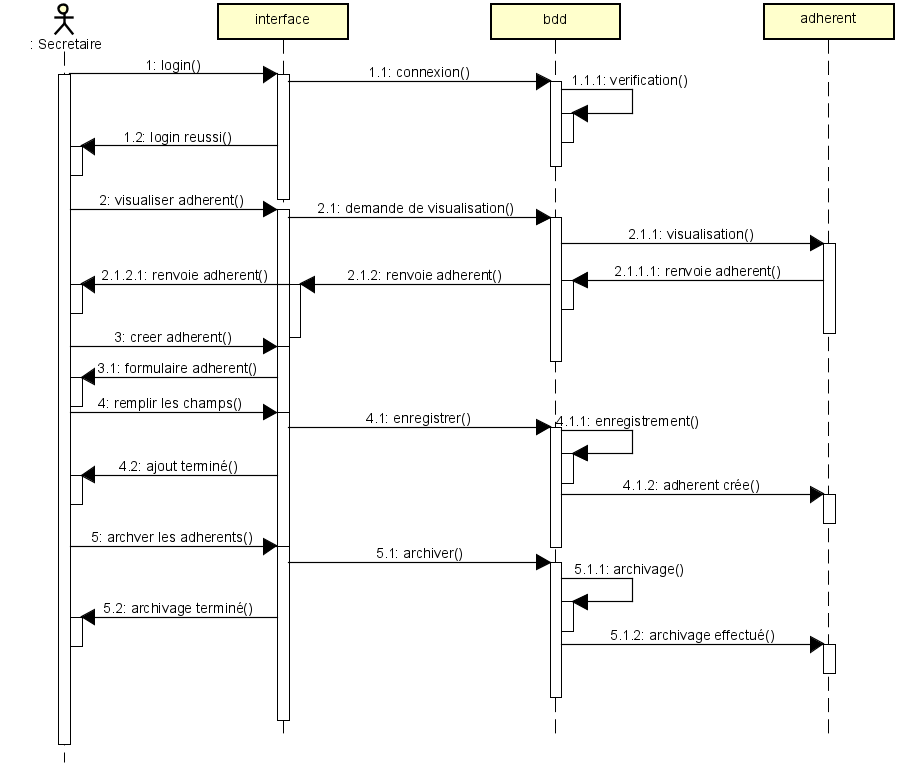

```                                                                                  
  _                       _____      _                
 | |                     |  __ \    | |               
 | |    _   _  ___  _ __ | |__) |_ _| |_ __ ___   ___ 
 | |   | | | |/ _ \| '_ \|  ___/ _` | | '_ ` _ \ / _ \
 | |___| |_| | (_) | | | | |  | (_| | | | | | | |  __/
 |______\__, |\___/|_| |_|_|   \__,_|_|_| |_| |_|\___|
         __/ |                                        
        |___/                                         

```
 
# - Lyon Palme - 
## ***Application : inscription des adhérents au club.***
  
Projet personnel encadré réalisé par **BOURAGHDA Yasser, PERRAT Tom, BERETONI Milan, PEREZ Valentin **,  
étudiant en 2e année de **BTS Services informatiques aux organisations Option SLAM**.  

Professeur : Mme CHATAING  
Sup'Chassagnes - Oullins (69)  
 
---

## Sommaire
1. [Introduction](#1-introduction)  
  1.1. [Présentation de l'application](#11-Présentation-del'application)  
  1.2. [Technologies et savoir-faire mis en oeuvre](#12-technologies-et-savoir-faire-mis-en-oeuvre)  
2. [Utiliser l'application](#2-utiliser-lapplication)  
  2.1. [Environnement logiciel requis](#21-environnement-logiciel-requis)  
  2.2. [Base de données](#22-Base-de-données)  
  2.3. [Installation de l'environnement](#23-Installation-de-l'environnement)
  2.4. [Authentification dans l'application (formulaire de connexion)](#24-authentification-dans-lapplication-formulaire-de-connexion)   
  2.5. [Formulaire d'accueil](#25-Formulaire-d'accueil)
  2.5.1. [Formulaire Connexion](#251-Formulaire-Connexion)
  2.5.2 [Navigation entre les formulaires](#252-navigation-entre-les-formulaires)
  2.5.3 [Formulaire d'accueil nageur](#253-Formulaire-d'accueil-nageur)
  2.5.4 [Formulaire d'accueil secretaire](#254-Formulaire-d'accueil-secretaire)
3. [Annexes](#3-annexes)  
  3.1. [UserCase](#31-UserCase)  
  3.2. [Modèle conceptuel de données](#32-Modèle-conceptuel-de-données)  
  3.3. [Diagramme de classes](#33-diagramme-de-classes)
  3.4. [Diagramme de sequence](#34-diagramme-de-sequence)    
4. [Remerciements](#4-remerciements)  

---

## 1. Introduction
### 1.1. Présentation de l'application
Une application gérant les inscriptions des adhérents au club doit être développée. 
Elle est utilisée par le(s) secrétaire(s) du club. 
Cette application permet au adhérent de ce connecter de pouvoir visualiser le trombinoscope, elle permet également la modification de données personnelles, de pouvoir changer son mot de passe, de cree des adhérents grace a des comptes de secretaires, d'archiver également des adhérents.

### 1.2. Technologies et savoir-faire mis en oeuvre
+ Framework : DJANGO
  + TEMPLATE
    + BOOSTRAP
    + HTML
  + MODELS
    + MAPPAGE
  + VIEW
    + FONCTION 
    + 
  + URL
  + MIGRATIONS
+ REQUIREMENTS.txt
  + django-cryptography
  + Pillow
  + psycopg2
+ DONNES 
  + Base de données : DBSQLITE
    + Liens 1 a * 
    + Chiffrement des données
  + Modélisation des données : UML, MCD
+ Système de contrôle de version :  Git
 
---

## 2. Utiliser l'application  
### 2.1. Environnement logiciel requis
+ Django  
+ Visual Studio code 2019 ou 2022
+ Debian  
+ Python3 

Informations sur les versions utilisées lors du développement de l'application :  
+ Django 4.2.2
+ Debian 
+ Python 3.11.4
+ VsCode 1.78.2


### 2.2. Base de données
Nous utiliseront pour la construction de ce site la base de données SQLITE


### 2.3. Installation de l'environnement
Avant tout il est important d'etre en mesure de bien installer notre application :

*ce deplacer dans le projet*  
```shell
cd inscriptions_lyon_palmes/
```

*Installer les différents et bien mettre notre venv dans inscriptions_lyon_palmes*  
```shell
sudo apt update
sudo apt install python3-pip
sudo apt-get install python3-venv
python3 -m venv venv
source venv/bin/activate
```

*installer les librairies*  
```shell
cd lyon_palme/
pip install -r requirements.txt
```

### 2.4. Authentification de l'application (formulaire de connexion)  
Le(s) secretaire(s) ce connecte a l'application en fournissant l'username et le mot de passe préalablement crée grace au superuser et au shell Django qu'il rentre pour accéder a l'application. 

*Pour crée un compte Secretaire il y a des etapes a suivres :*

```shell
python3 manage.py createsuperuser
Nom d’utilisateur: secretaire
Email d’utilisateur: secretaire@gmail.com
Password d’utilisateur: C1Secret!
```
| Identifiant        | Mot de passe      |
|--------------------|-------------------|
| secretaire         | C1Secret!         |

*Pour crée un compte Adhérents il y a des etapes a suivres :*
```shell
Ce connecter en Secrétaire, la secretaire inscris un adhérent
avec cet url *URL = http://127.0.0.1:8000/inscription/accueil_secretaire/
ensuite cliquer sur inscrire un adhérent
le compte de l'adhérent ce componsera en deux partie 
premier *l'initiale du prenom + le nom* 
le mot de passe sera la date de naissance : *AAAA-MM-JJ*
une fois la premiere connexion
```
exemple si je crée via un compte secrétaire un compte avec comme nom et prenom BOURAGHDA Yasser et comme date de naissance 20/11/2023
voici un exemple pour ce connecter désormais comme nageur.
| Identifiant        | Mot de passe      |
|--------------------|-------------------|
| YBOURAGHDA         | 2023-11-20        |

Des sa premiere connexion le nageur sera invité a changer de mot de passe avec un mot de passe plus robuste, en cas d'oublie du mot de passe
en rentrant son adresse email, la secretaire lui enverra un nouveau MDP.
### 2.5. Navigation entre les Pages
#### 2.5.1. Formulaire de Accueil

+ *URL = http://127.0.0.1:8000/inscription/*
La première interface visible par l'utilisateur est le formulaire d'accueil, qui permet de visualiser le contexte du site, d'acceder a la politique de confidentialité du site.
*URL = http://127.0.0.1:8000/inscription/politique_confidentialite* 
+ Navbar.
Dans cet navbar nous pouvons nous connecter pour acceder aux différentes pages qui vont nous interesser, l'une pour ce connecter comme NAGEUR et l'autre pour ce connecter en SECRETAIRE.

#### 2.5.2. Formulaire Connexion
Une fois l'authentification réussie, l'utilisateur est amené au formulaire principal de l'application.    
L'interface Accueil est composé en deux partie
| Formulaire 1       | Formulaire 2      |
|--------------------|-------------------|
| NAGEUR             | SECRETAIRE        |

+ Formulaire NAGEUR
+ *URL = http://127.0.0.1:8000/inscription/login_nageur* 
  + Le formulaire de connexion nageur permet d'acceder a la page d'acceuil nageur.
  + en cas d'oublie du mot de passe nageur, nous pouvons accéder a la fonctionnalité mot de passe oublié.

+ Formulaire 2
+ *URL = http://127.0.0.1:8000/inscription/login_secretaire*
  + Le formulaire de connexion secretaire permet d'acceder a la page d'acceuil secretaire.

#### 2.5.3. Formulaire d'accueil nageur
+ *URL = http://127.0.0.1:8000/inscription/accueil_nageur*
en accédant a ce formulaire grace a notre user crée dans django nous pourrons avoir acces a plusieur fonctionnalité.

+ Le nageur peut acceder au trombinoscope
+ Le Nageur peut ce déconnecter 
+ Le Nageur peut retourner dans l'accueil 

#### 2.5.4. Formulaire d'accueil secretaire
+ *URL = http://127.0.0.1:8000/inscription/accueil_secretaire*
en accédant a ce formulaire grace a notre superuser crée dans django nous pourrons avoir acces a plusieur fonctionnalité.

+ le secretaire peut modifier sont mots de passe
+ le secretaire peut voir la listes des différents nageur 
+ le secretaire peut modifier les données personelles des nageurs
+ le secretaire peut archiver les données personelles des nageurs

## 3. Annexes  
### 3.1. UserCase    
 

### 3.2. Modèle conceptuel de données  
  
  
### 3.3. Diagramme de classes
 

### 3.4. Diagramme de sequence


---

## 4. Remerciements 
MERCI
Voici les différentes sources que nous avons pu utiliser.     
+ **Madame Chataing** Les cours en ligne Teams de madame Chataing [TEAMS]
  + [La Formation Complète Django [2022]](https://www.youtube.com/watch?v=Bn0k9DDYBZM&t=5502s)
  + [Django Python](https://www.youtube.com/watch?v=tZ4LXyJAj3w&list=PLh-rUZWaw76H5XOcYneHhuvypENDCkpAf)

+ A CHATGPT **[CHATGPT](https://chat.openai.com/)**

  

